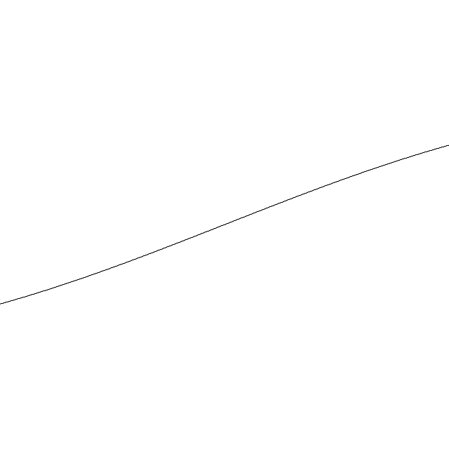

# Gavin's Processing Sketchbook

## Sketches

<table>
<tbody>
<!-- <tr>
<th>Sketch</th>
<th>Description</th>
<th>Output Sample</th>
<tr> -->
<tr>
<td>
<!--  -->
</td>
<td><a href="sketch_230130b_ShaderWave/">sketch_230130b_ShaderWave</a></td>
<td>Render audio data in with a shader</td>
</td>
<tr>
<tr>
<tr>
<td>
<!--  -->
</td>
<td><a href="sketch_230119_WavCubeHelix/">sketch_230129a_Shader</a></td>
<td>My first try rendering a shader</td>
</td>
<tr>
<tr>
<td>
<!--  -->
</td>
<td><a href="sketch_230119_WavCubeHelix/">sketch_230119_WavCubeHelix</a></td>
<td>Draw parts of an audio file</td>
</td>
<tr>
<tr>
<tr>
<td>
<!--  -->
</td>
<td><a href="sketch_210303a_SinePhase/">sketch_210303a_SinePhase</a></td>
<td>Draw sine waves</td>
</td>
<tr>
</tbody>
</table>

## Notes

Libraries that need to be installed to run all of the sketches in this sketchbook:

- [controlP5](https://sojamo.de/libraries/controlP5/)
- [Cubehelix](https://github.com/grough/processing-cubehelix)
- [Sound](https://processing.org/reference/libraries/sound/)

<!-- Every sketch on the main branch should be in working order. If you change a sketch, and it works, commit it. If you change a sketch, and it's broken, don't commit it. This way, you can always revert to a working state by picking a commit on the main branch. -->